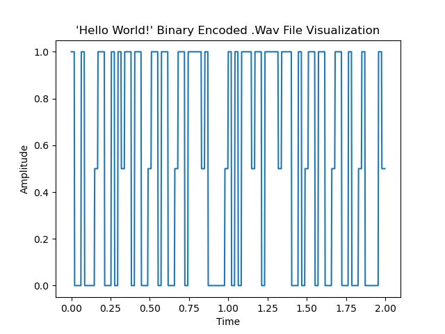

# WavEncoderDecoder
Encodes and decodes data into a .wav file format

For now, strings and numbers can be encoded into the .wav file format.
The string gets processed into binary ascii representations, and these binary values are encoded into the .wav file 
using a duration in milliseconds per bit, an amplitude (w/ half amplitude representing spaces between characers) and a sample rate.
The number of samples in the wave file is proportional to these characteristics and is calculated as:
  ### number of bits to transmit * (duration in milliseconds per bit * (sample rate / 1000))

The data is stored in the .wav file as a step function representation, with 0s represented as no amplitude, between character bits represented
as 0.5 amplitude, and 1s represented as full amplitude.

In the decoding phase, the duration per bit (or you can think of it as the protocol) and the number of samples is used
to decode the continuous binry data into the ascii binary character representations, and then finally to standard strings.

The project also includes two function to visualize the binary data as a step function plot, and the .wav
file data as a step function plot using matplotlib.

The image below is what the .wav file looks like when encoding "Hello World!" as binary ascii values with a sample
rate of 44100Hz, a max amplitude of 1, and a duration in milliseconds per bit of 2.
